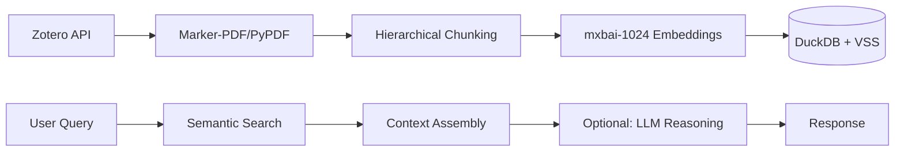

# Zotero Semantic Search & RAG System
[](https://opensource.org/licenses/MIT)

**Zotero Agentic RAG for Scientific Literature** — a fully local, production-oriented Retrieval-Augmented Generation system specialized for complex scientific papers.

The system integrates the **Zotero Local API** with **layout-aware PDF parsing** (`marker-pdf`), custom regex post-processing, smart hierarchical chunking, DuckDB + VSS (HNSW) vector search, and a **stateful LangGraph-powered Generator ↔ Critic reflection loop**. It also includes a FastAPI service layer for programmatic access and decoupled deployment.

Built for and used daily in computational physics research, where answering technical questions often requires retrieving precise passages from dozens of multi-column papers containing equations and tables. Beyond building the system, the focus is on measurable improvements: I evaluated how parsing quality and preprocessing directly affect embedding alignment and retrieval accuracy.

### Key Contributions & System Insights

## 🌟 Key Contributions

- Identified PDF parsing quality as a key bottleneck in scientific RAG systems and analyzed its downstream impact on retrieval accuracy  
- Demonstrated that layout-aware parsing significantly improves retrieval on complex documents (tables, equations, multi-column text)  
- Designed a lightweight evaluation workflow enabling rapid iteration and system-level analysis  
- Built a modular RAG pipeline with LangGraph orchestration and FastAPI-based deployment

The system prioritizes **retrieval quality over model complexity**, reflecting how real production ML systems are built and optimized in practice.

## 📺 Demos

|                       Semantic Search                        |                      Simple Generation                       |                       Reflection Loop                       |
| :----------------------------------------------------------: | :----------------------------------------------------------: | :---------------------------------------------------------: |
|                       |                               |                             |
| *Sub-second retrieval across 200+ papers using DuckDB HNSW.* | *Direct answering using LLM synthesis of retrieved context.* | *Source verification and fact-checking via a Critic model.* |

## 🌟 Key Features

- **Dual-Mode Retrieval**
  - **Semantic Search**: Sub-second vector search over 200+ papers (no LLM overhead)  
  - **Full RAG**: LLM-based synthesis with optional source verification  

- **Agentic Pipeline (LangGraph)**
  - Modular state-machine workflow with Generator ↔ Critic loop  
  - Conditional routing (re-search / refine / return)  
  - Easily extensible for additional tools (e.g., web search, Zotero API)

- **Efficient Context Retrieval**
  - Standard chunking with ±N neighbor expansion for semantic continuity  
  - Improves coherence compared to isolated chunk retrieval  

- **Layout-Aware PDF Processing**
  - `marker-pdf` preserves multi-column layouts, tables, and equations  
  - Reduces noise from flattened text and improves embedding quality  
  - Regex-based cleanup removes parsing artifacts (e.g., HTML tags)

- **Source Attribution & Verification**
  - Extracts and displays cited passages from retrieved documents  
  - Provides quick validation of answer grounding  

- **Local-First Architecture**
  - Fully local inference via Ollama (no external API calls)  
  - DuckDB + VSS enables fast, in-process vector search  

* **Metadata-Aware Search**: Filter by paper title (experimental)

---
### 📊 Parsing Quality as a Bottleneck

Scientific PDFs often contain multi-column layouts, tables, and equations that are poorly handled by standard extraction tools.

| Equations | Tables |
|----------|--------|
|  |  |

- **Standard parsing** flattens tables into linear text, mixing columns and introducing noise  
- **Layout-aware parsing** preserves structure, semantic boundaries, and LaTeX equations  

👉 Improved structural fidelity leads to better embedding alignment and more accurate retrieval.

📄 See [docs/evaluation.md](./docs/evaluation.md) for details.

---
## 🏗️ Architecture

The system follows a modular flow from raw data to generated insight:



* **Vector Database**: DuckDB with the VSS (Vector Similarity Search) extension for efficient, local, and persistent storage.
* **Local Inference**: Powered by Ollama to ensure data privacy and offline capability.

### Flexible Deployment Architecture

The system supports a **dual-mode execution model**, enabling both tightly integrated workflows and decoupled service-based deployment.
#### 1. Integrated Mode (Direct Library)

In this mode, the Streamlit UI invokes the LangGraph engine directly within the same process.

**Use Case:** Rapid prototyping and research workflows, where fast iteration and dynamic model switching (e.g., Llama-3.1 ↔ GPT-OSS) are required.
**Trade-off:** Increased local resource overhead, as the UI and inference pipeline share the same process and memory space.

#### 2. Service Mode (FastAPI Layer)

The system exposes the retrieval and RAG pipeline through a FastAPI backend, enabling a service-oriented architecture.

**Deployment Pattern:** Decouples the inference layer (“brain”) from the interface (“client”), aligning with standard production architectures.
**Performance:** Reduces end-to-end latency by keeping the LLM and vector database resident in memory, avoiding repeated model initialization and cold-start overhead.
**Constraint:** Uses a fixed-engine configuration for stability. Model selection is controlled via `settings.yaml` rather than runtime switching, ensuring consistent performance and reproducibility.

---
## 🧠 Design Notes

Key design decisions (chunking strategy, LLM usage, reflection loop) are documented here:

📄 [docs/design.md](./docs/design.md)

---
## 🛠️ Tech Stack

- **Data Source**: Zotero 7/8 + Local API
- **PDF Processing**: `marker-pdf` (layout-aware) or `pypdf` (fast/CPU fallback)
- **Embeddings**: `mxbai-embed-large` (1024-dimensional vectors)
- **Vector Store**: DuckDB + VSS (in-process, low-latency retrieval)
- **LLMs**: Llama 3.1 or configurable via Ollama
- **Orchestration**: LangGraph (modular RAG pipeline with agent/critic loop)
- **API Layer**: FastAPI (service-mode deployment and inference endpoint)
- **UI Framework**: Streamlit

---
## 🚀 Getting Started

### 1. Prerequisites
* **Python**: 3.12.2 recommended.
* **Zotero**: Enable Local API (Settings > Advanced > "Allow other applications... to communicate with Zotero").
* **Ollama**: Install and pull required models:
    ```bash
    ollama pull mxbai-embed-large
    ollama pull llama3.1:latest
    ```

### 2. Environment Setup
```bash
python -m venv venv
source venv/bin/activate  # macOS/Linux
# venv\Scripts\activate  # Windows
pip install --upgrade pip
pip install -r requirements.txt
```

### 3. PDF Parsing Configuration
* **GPU (Recommended)**: For `marker-pdf` with CUDA acceleration, use the provided Docker container logic.
* **CPU**: Install `marker-pdf` or `pypdf` locally:
    ```bash
    pip install marker-pdf pypdf
    ```
    *Note: The first run with `marker` will download ~1.4GB of layout and OCR models to `~/.cache/huggingface`*.

---
## 📂 Project Structure

```text
├── app/
│   ├── ingestion/       # PDF parsing & DuckDB+VSS schema
│   ├── api/             # FastAPI
│   ├── retrieval/       # Hybrid search & HNSW configuration
│   ├── core/            # LLM configuration (config.py)
│   ├── agent/           # Generator/Critic modular logic
│   └── utils/           # Zotero API & Query distillation helpers
├── experimental/        # experimental CLI tools (single_query, search, chat)
├── evaluation/          
├── streamlit_app.py     # Main GUI Entry Point
├── ingest_db.py         # Database build and sync utility
└── settings.yaml        # Shared application configuration
```

---
## 📖 Usage

### 📂 File Path Configuration

  To run the ingestion and the application, you must define the following paths in ingest_db.py and `settings.yaml` (and docker scripts if used):

  | Parameter | Description | Typical Value |
  | :--- | :--- | :--- |
  | **`ZOTERO_STORAGE`** | The local directory where Zotero stores your PDF attachments. | `~/Zotero/storage` |
  | **`DB_DIR`** | The directory on your host machine where the persistent DuckDB files will be saved. | `~/db_zotero_rag` |
  | **`BASE_NAME`** | The filename for your database.  | `zotero_physics_v1.db` |

  #### Detailed Parameter Breakdown:

  * **`ZOTERO_STORAGE`**: This path (typically ~Zotero/storage) contains the PDFs for parsing. If you are running the project directly, the engine will access this folder locally; if using Docker, this path is mounted into the container so the marker-pdf engine can read your research papers. Ensure the directory contains the subfolders where your PDF files are stored.
  * **`DB_DIR`**: This directory holds the `.db` files and the parsed files stored inside `_cache` folder (in `.md` format). By keeping this outside the container, your data remains persistent even if the container is deleted.
  * **`BASE_NAME`**: The system uses this to create a unique database file. This is helpful if you want to maintain separate databases for different chunking strategies (  e.g., `large_chunk_v1.db` vs `small_chunk_v1.db`).

_**Important**: The path to the .db file should be consistent with settings.yaml (and docker_pytorch.sh if used)_

  ---
### Data Ingestion: Create your database
Populate your vector database from your Zotero library:
```bash
python ingest_db.py
```

*Configure `chunk_size` and `chunk_overlap` within `ingest_db.py` to tune granularity*.
### Running the UI
Launch the Streamlit dashboard:
```bash
streamlit run RAG_Zotero
```
or 
```
streamlit run RAG_Zotero/streamlit_app.py
```

### experimental CLI Tools
* **Semantic Search Only**: `python -m app.experimental.search_cli`
* **Full RAG Chat**: `python -m app.experimental.chat_cli`
* **Simple Query example**: `python -m app.experimental.single_query`

---
## 🐳 Docker & DGX spark Integration
For heavy-duty ingestion (marker-pdf parsing) on NVIDIA DGX or CUDA-enabled servers, use the PyTorch-optimized container:
1.  Run the initial setup: `sh docker_pytorch_1st_install.sh` (modified from the official playbook: [Fine-tune with Pytorch](https://build.nvidia.com/spark/pytorch-fine-tune/instructions)).
2.  Install libraries
    ```pip install marker-pdf duckdb langchain-ollama langchain-community pyyaml requests streamlit pypdf```
3.  To avoid having to reinstall libraries, commit the container by running the following outside of the docker environment:
    `docker commit <container_id> zotero-rag:v1`
    `<container_id>` can be found using `docker ps`
4.  After the initial setup, run `docker_pytorch.sh` for future use.

_Note:
The default image name is set to zotero-rag:v1. If you choose to rename it, ensure the new name is updated consistently within the docker_pytorch.sh script._

```
make sure the following empty folders exist insider data/ to avoid permssion issues
├── app/
├── data/ (project root)
     ├── hf_cache/
     ├── database/
     └── Zotero/

```

or Change ownership for all the folders need to be modifed from docker
```sudo chown -R $(id -u):$(id -g) ~/.cache/huggingface ~/db_zotero_rag $(pwd)```

# ⚙️ Configuration (settings.yaml)
The system's behavior is managed via settings.yaml. This allows you to swap models and update paths without touching the core logic.

```YAML
infrastructure:
  db_path: "..."            # Absolute path to your DuckDB file
  embedding_model: "..."    # Ollama model used for vector encoding

agent:
  generator:
    model: "..."           # The primary LLM for answering questions
    temperature: 0         # 0 for deterministic, factual responses
  critic:
    model: "..."           # Smaller model used to verify retrieval quality
  max_retries: 0           # How many times the critic can request a re-search
```

Key Parameters Explained:
`infrastructure.db_path`: Ensure this matches the DB_PATH generated during ingestion. If moving from DGX to a local laptop, update this to your local path.

`agent.generator`: This is the "Writer." Models like llama3.1 or gpt-oss are recommended for complex synthesis.

`agent.critic`: This is the "Fact-Checker." It evaluates if the retrieved context actually answers your question. Using a smaller model like nemotron-3-nano keeps the system fast.

`temperature`: Set to 0 across the board to ensure the AI prioritizes the provided scientific text over "hallucinating" creative answers.

## 🎯 Current Status

**Production-ready for daily research use:**
- ✅ 200+ papers indexed from my Zotero library
- ✅ Sub-second semantic search
- ✅ Multi-model RAG with source verification
- ✅ Daily use in active computational research workflow

**Known Limitations:**
- Critic verification adds latency without consistent quality gain (hence disabled by default).
- Implicit Property Extraction: The system may struggle with target information that is not explicitly stated as a numerical value. For example, properties like Critical Temperature ($T_c$) are often discussed implicitly through measurements of magnetic susceptibility or heat capacity rather than being labeled directly.

## 🗺️ Planned Extensions
- [ ] Hybrid Search: Combine DuckDB's keyword matching (BM25) with vector similarity (HNSW) to improve retrieval of specific chemical formulas or non-semantic technical terms.
- [ ] BibTeX Export: Allow users to export search result citations directly into .bib format for LaTeX integration.
- [ ] Metadata filters: Filter by author, year, or Zotero tags for scoped retrieval
- [ ] RAG Evaluation Framework: Integrate RAGAS to implement objective evaluation metrics (Faithfulness, Answer Relevance) tailored to physics-domain queries.
