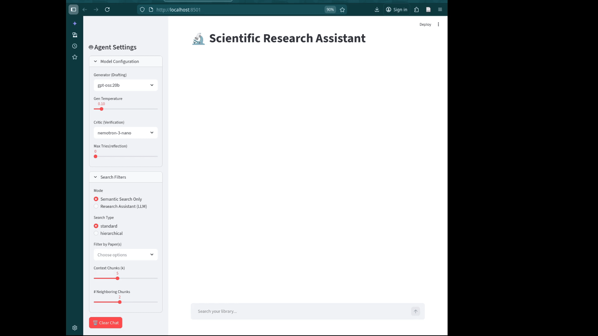
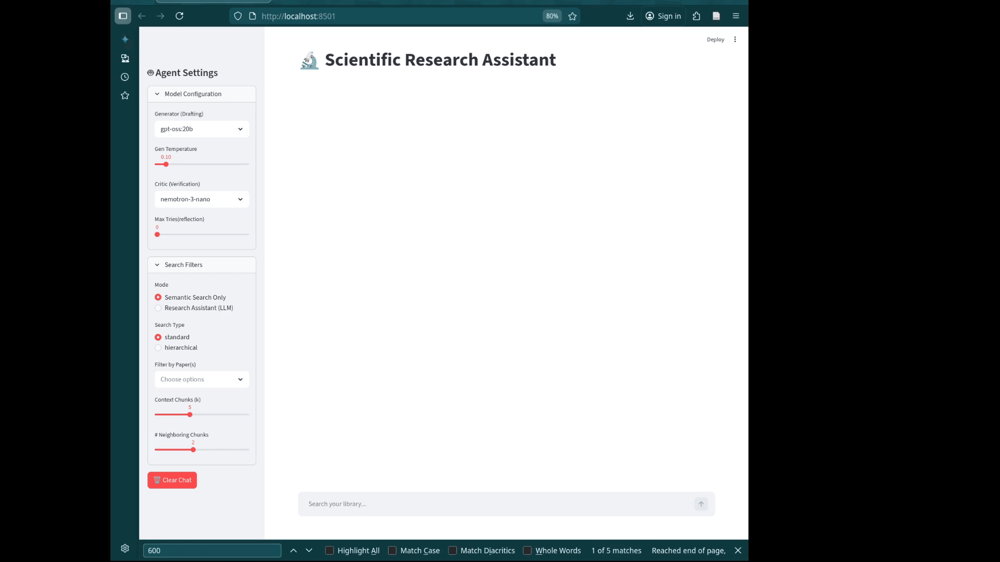
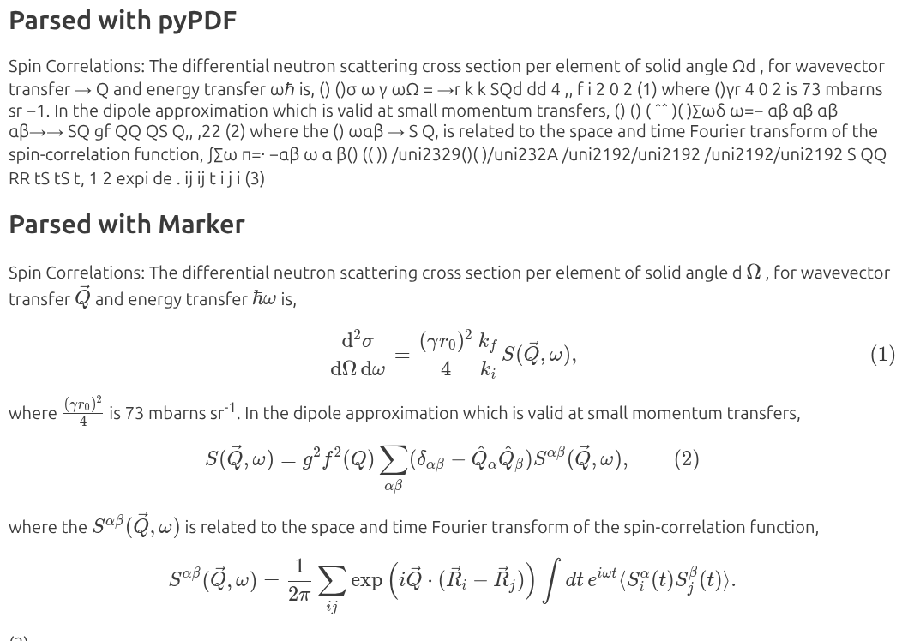
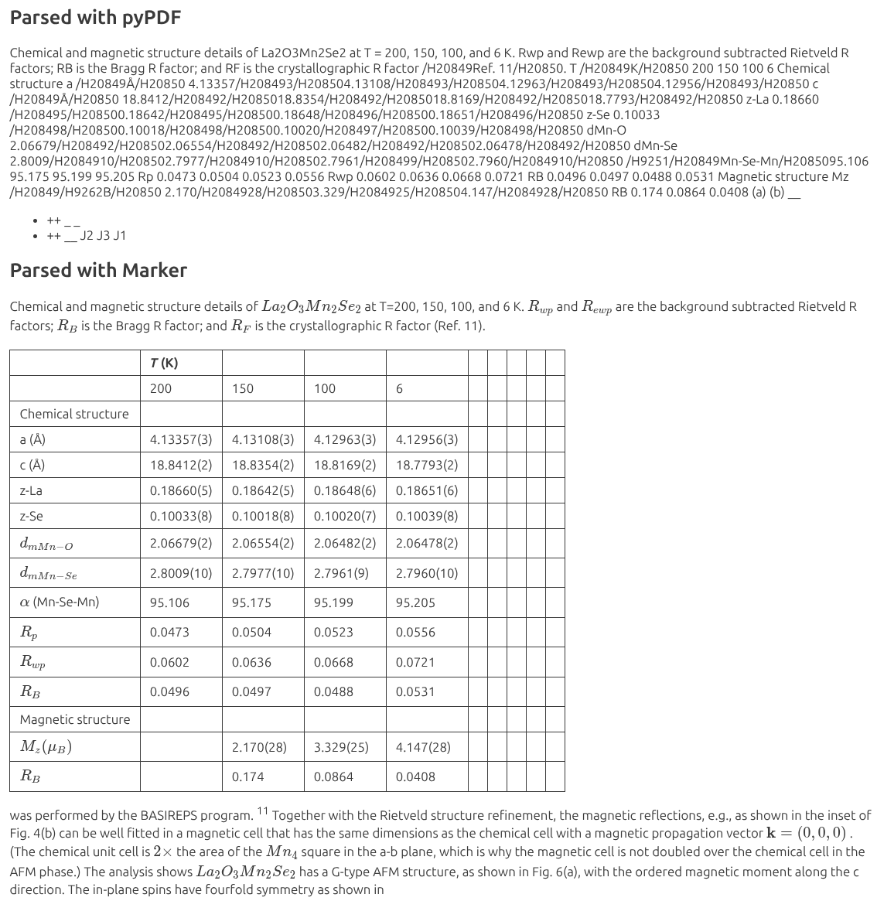
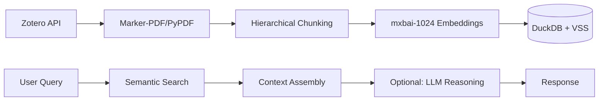

# Zotero Semantic Search & RAG System
[](https://opensource.org/licenses/MIT)

**Zotero Agentic RAG for Scientific Literature** — a fully local, production-oriented Retrieval-Augmented Generation system for complex scientific papers.

Built on the **Zotero Local API**, the system integrates **layout-aware PDF parsing** (`marker-pdf`), regex-based post-processing, hierarchical chunking, and DuckDB + VSS (HNSW) vector search, with a **stateful LangGraph-powered Generator ↔ Critic loop**. A FastAPI layer enables programmatic access and decoupled deployment.

### Key Contributions & System Insights

- Identified PDF parsing quality as a key bottleneck in scientific RAG systems and analyzed its downstream impact on retrieval accuracy
- Demonstrated that layout-aware parsing significantly improves retrieval on complex documents (tables, equations, multi-column text)
- Designed a lightweight evaluation workflow enabling rapid iteration and system-level analysis
- Built a modular RAG pipeline with LangGraph orchestration and FastAPI-based deployment

## 📺 Demos

|                       Semantic Search                        |                      Simple Generation                       |                       Reflection Loop                       |
| :----------------------------------------------------------: | :----------------------------------------------------------: | :---------------------------------------------------------: |
|                       |                               |                             |
| *Sub-second retrieval across 200+ papers using DuckDB HNSW.* | *Direct answering using LLM synthesis of retrieved context.* | *Source verification and fact-checking via a Critic model.* |
## 🌟 Key Features

- **Dual-Mode Retrieval**
  - **Semantic Search**: Sub-second vector search over 200+ papers (no LLM overhead)
  - **Full RAG**: LLM-based synthesis with optional source verification

- **Agentic Pipeline (LangGraph)**
  - Modular state-machine workflow with Generator ↔ Critic loop
  - Conditional routing (re-search / refine / return)
  - Easily extensible for additional tools (e.g., web search, Zotero API)

- **Efficient Context Retrieval**
  - Standard chunking with ±N neighbor expansion for semantic continuity
  - Improves coherence compared to isolated chunk retrieval

- **Layout-Aware PDF Processing**
  - `marker-pdf` preserves multi-column layouts, tables, and equations
  - Reduces noise from flattened text and improves embedding quality
  - Regex-based cleanup removes parsing artifacts (e.g., HTML tags)

- **Source Attribution & Verification**
  - Extracts and displays cited passages from retrieved documents
  - Provides quick validation of answer grounding

- **Local-First Architecture**
  - Fully local inference via Ollama (no external API calls)
  - DuckDB + VSS enables fast, in-process vector search

---
### 📊 Parsing Quality as a Bottleneck

Scientific PDFs often contain multi-column layouts, tables, and equations that are poorly handled by standard extraction tools.

| Equations                                      | Tables                                      |
| ---------------------------------------------- | ------------------------------------------- |
|  |  |

- **Standard parsing** flattens tables into linear text, mixing columns and introducing noise
- **Layout-aware parsing** preserves structure, semantic boundaries, and LaTeX equations

👉 Improved structural fidelity leads to better embedding alignment and more accurate retrieval.

📄 See [docs/evaluation.md](./docs/evaluation.md) for details.

---
## 🏗️ Architecture

The system follows a modular flow from raw data to generated insight:



* **Vector Database**: DuckDB with VSS for local, low-latency retrieval
* **Local Inference**: Powered by Ollama for privacy and offline use

### Flexible Deployment Architecture

Supports a **dual-mode execution model**:

**1. Integrated Mode (Direct Library)**
- Streamlit UI calls the LangGraph engine in-process.
- Best for rapid prototyping and dynamic model switching.
- Trade-off: shared resources between UI and inference.

**2. Service Mode (FastAPI Layer)**
- Exposes RAG pipeline via API for decoupled deployment.
- Keeps models and vector DB in memory → lower latency.
- Uses fixed-engine configuration (`settings.yaml`) for stability.

---
## 🧠 Design Notes

Key design decisions (chunking strategy, LLM usage, reflection loop) are documented here:

📄 [docs/design.md](./docs/design.md)

---
## 🛠️ Tech Stack

- **Data Source**: Zotero 7/8 + Local API
- **PDF Processing**: `marker-pdf` (layout-aware) or `pypdf` (fast/CPU fallback)
- **Embeddings**: `mxbai-embed-large` (1024-dimensional vectors)
- **Vector Store**: DuckDB + VSS (in-process, low-latency retrieval)
- **LLMs**: Llama 3.1 or configurable via Ollama
- **Orchestration**: LangGraph (modular RAG pipeline with agent/critic loop)
- **API Layer**: FastAPI (service-mode deployment and inference endpoint)
- **UI Framework**: Streamlit

---
## 🚀 Getting Started

### 1. Prerequisites
* **Python**: 3.12.2 recommended.
* **Zotero**: Enable Local API (Settings > Advanced > "Allow other applications... to communicate with Zotero").
* **Ollama**: Install and pull required models:
    ```bash
    ollama pull mxbai-embed-large
    ollama pull llama3.1:latest
    ```
### 2. Environment Setup
```bash
python -m venv venv
source venv/bin/activate  # macOS/Linux
# venv\Scripts\activate  # Windows
pip install --upgrade pip
pip install -r requirements.txt
```
### 3. PDF Parsing Configuration
* **GPU (Recommended)**: For `marker-pdf` with CUDA acceleration, use the provided Docker container logic.
* **CPU**: Install `marker-pdf` or `pypdf` locally:
```bash
pip install marker-pdf pypdf
```
    *Note: The first run with `marker` will download ~1.4GB of layout and OCR models to `~/.cache/huggingface`*.
---
## 📂 Project Structure

```text
├── app/
│   ├── ingestion/       # PDF parsing & DB schema
│   ├── api/             # FastAPI service
│   ├── retrieval/       # Search logic
│   ├── core/            # LLM configuration
│   ├── agent/           # Generator/Critic
│   └── utils/           # Zotero API & helpers
├── experimental/        # experimental CLI tools
├── evaluation/
├── streamlit_app.py     # Main GUI Entry Point
├── ingest_db.py         # Database build and sync utility
└── settings.yaml        # Shared application configuration
```
---
## 📖 Usage

### 📂 File Path Configuration

To run the ingestion and the application, you must define the following paths in ingest_db.py and `settings.yaml` (and docker scripts if used):

  | Parameter | Description | Typical Value |
  | :--- | :--- | :--- |
  | **`ZOTERO_STORAGE`** | The local directory where Zotero stores your PDF attachments. | `~/Zotero/storage` |
  | **`DB_DIR`** | The directory on your host machine where the persistent DuckDB files will be saved. | `~/db_zotero_rag` |
  | **`BASE_NAME`** | The filename for your database.  | `zotero_physics_v1.db` |

**Important**: The path to the .db file should be consistent with settings.yaml (and docker_pytorch.sh if used)
### Data Ingestion: Create your database
Populate your vector database from your Zotero library:
```bash
python ingest_db.py
```

*Configure `chunk_size` and `chunk_overlap` within `ingest_db.py` to tune granularity*.
### Running the UI
Launch the Streamlit dashboard:
```bash
streamlit run RAG_Zotero
```
or
```
streamlit run RAG_Zotero/streamlit_app.py
```
### Using api
Run the following command before streamlit UI:
```bash
python -m app.api.main
```
### experimental CLI Tools

* **Semantic Search Only**: `python -m app.experimental.search_cli`
* **Full RAG Chat**: `python -m app.experimental.chat_cli`
* **Simple Query example**: `python -m app.experimental.single_query`

---
## 🐳 Docker & DGX spark Integration

For GPU-accelerated PDF parsing and large-scale ingestion, a Docker-based workflow is available.

📄 [docs/docker.md](./docs/docker.md)
# ⚙️ Configuration (settings.yaml)
The system's behavior is managed via `settings.yaml`. This allows you to swap models and update paths without touching the core logic.

```
infrastructure:
  db_path: "..."            # Absolute path to your DuckDB file
  embedding_model: "..."    # Ollama model used for vector encoding

agent:
  generator:
    model: "..."           # The primary LLM for answering questions
    temperature: 0         # 0 for deterministic, factual responses
  critic:
    model: "..."           # Smaller model used to verify retrieval quality
  max_retries: 0           # How many times the critic can request a re-search

models:                    # Modeify accordingly
  generator_options:
    - gpt-oss:20b
    - gemini-2.5-flash

  critic_options:
    - nemotron-3-nano
    - gpt-4o
```

Key Parameters Explained:
`infrastructure.db_path`: Update this to your local path and ensure this matches the DB_PATH generated during ingestion.
`agent.generator`: This is the "Writer." Models like llama3.1 or gpt-oss are recommended for synthesis.
`agent.critic`: This is the "Fact-Checker." It evaluates if the retrieved context actually answers your question.
`temperature`: Set to 0 across the board to ensure the AI prioritizes the provided scientific text over "hallucinating" creative answers.

Model Configuration Notes:
- The `models.generator_options` and `models.critic_optionsi` lists define **which models appear in the Streamlit UI dropdowns**.
- To add a new model (e.g., OpenAI or Gemini), you must:
  1. Add the model name to the appropriate list in settings.yaml
  2. Ensure the corresponding provider is supported in the code (get_model() in app/core/config.py )
- The system **does not auto-discover available models** — this design keeps behavior explicit and reproducible.

### Optional: Commercial LLM Providers

Support for external providers (e.g., OpenAI, Gemini) is optional.

#### Setup
```bash
pip install -r requirements-optional.txt
```

Create a `.env` file in the project root:
```bash
OPENAI_API_KEY=...
GOOGLE_API_KEY=...
```

**Notes**
- API usage may incur cost depending on model and token usage
- Local models via Ollama are recommended for most experimentation

## 🎯 Current Status

**Production-ready for daily research use:**
- ✅ 200+ papers indexed from local Zotero library
- ✅ Sub-second semantic search
- ✅ Multi-model RAG with source verification

**Known Limitations:**
- Critic verification adds latency without consistent quality gain (hence disabled by default).
- Implicit Property Extraction: The system may struggle with target information that is not explicitly stated as a numerical value. For example, properties like Critical Temperature ($T_c$) are often discussed implicitly through measurements of magnetic susceptibility or heat capacity rather than being labeled directly.
## 🗺️ Planned Extensions

- [ ] Hybrid Search: Combine DuckDB's keyword matching (BM25) with vector similarity (HNSW) to improve retrieval of specific chemical formulas or non-semantic technical terms.
- [ ] BibTeX Export: Allow users to export search result citations directly into .bib format for LaTeX integration.
- [ ] Metadata filters: Filter by author, year, or Zotero tags for scoped retrieval
