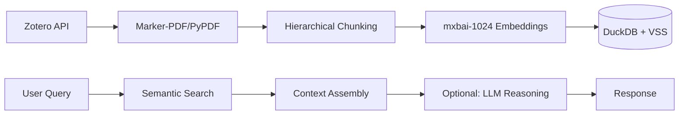

# Zotero Semantic Search & RAG System
[](https://opensource.org/licenses/MIT)

**Agentic RAG for Scientific Literature** is an end-to-end fully local Retrieval-Augmented Generation system built with **LangGraph**, DuckDB + VSS (HNSW), and Ollama.

Zotero-Insight-RAG was created for daily use in computational physics research, where answering technical questions requires retrieving precise passages from dozens of papers rather than generic summaries. The system integrates the Zotero Local API, layout-aware PDF parsing (`marker-pdf`), smart hierarchical chunking with neighbor expansion, vector search, and a **stateful LangGraph-powered Generator ↔ Critic reflection loop** into a modular, offline-first pipeline optimized for accuracy, traceability, and real-world research workflows.

## 📺 Demos

| Semantic Search | Simple Generation | Reflection Loop |
| :---: | :---: | :---: |
|  |  |  |
| *Sub-second retrieval across 200+ papers using DuckDB HNSW.* | *Direct answering using LLM synthesis of retrieved context.* | *Source verification and fact-checking via a Critic model.* |

## 🌟 Key Features

* **Dual-Mode Retrieval**:
  - **Semantic Search**: Sub-second retrieval over 100+ of papers (no LLM overhead)
  - **Full RAG**: LLM-powered reasoning with automatic source verification

- **LangGraph Agentic Loop**:
  - Full state-machine implementation using LangGraph for clean conditional routing (critic score → re-search / re-write query / return)
  - Persistent memory across steps + easy extension points for future tools (web search, Zotero API calls, etc.)

* **Smart Chunking Strategies**:
  - Hierarchical parent-child for multi-hop queries
  - Standard + ±N neighbor expansion for precise retrieval
  - Empirically validated: ±2 neighbors significantly improves coherence vs isolated chunks

* **Context Expansion**: Automatically retrieves neighboring chunks to preserve semantic continuity across paragraph boundaries

* **Production PDF Parsing**:
  - `marker-pdf` handles multi-column scientific papers, equations, tables
  - Layout-aware extraction prevents gibberish from 2-column formats
  - **Custom post-processing**: HTML tag filtering (regex post-processing) removes `<sup>`, `<sub>` artifacts that contaminate embeddings
  - Fallback to `pypdf` for speed on simple documents

* **Rigorous Source Attribution**:
  - Automatic citation extraction from LLM responses
  - Direct source display with exact quoted passages
  - Verification badges (✅/⚠️) for quality signaling

* **Metadata-Aware Search**: Filter by paper title (experimental)

---
## 🏗️ Architecture

The system follows a modular flow from raw data to generated insight:



* **Vector Database**: DuckDB with the VSS (Vector Similarity Search) extension for efficient, local, and persistent storage.
* **Local Inference**: Powered by Ollama to ensure data privacy and offline capability.

---
## 🧠 Key Design Decisions

### Chunking Strategy: Hierarchical vs Standard + Neighbors

After empirical testing, I found that **standard chunking with ±2 neighbor expansion** outperforms parent-child hierarchical chunking for targeted information retrieval:

- **Parent-child**: Better for complex multi-hop reasoning requiring broad context.
- **Standard + neighbors**: Better for precise fact extraction while maintaining semantic continuity.
- **Result**: System supports both modes; users can choose based on query type.

### LLM-Optional Architecture: Semantic Search is Often Enough

The system supports two operational modes:

1. **Semantic Search Only**: Pure vector similarity retrieval without LLM inference.
2. **Full RAG**: LLM-powered synthesis with optional verification.

- **Empirical finding**: For most research queries, **semantic search alone provides sufficient precision**. Questions like "what papers discuss spin Hall effect?" or "experimental methods for measuring Néel temperature" are answered directly by retrieving relevant passages — no generation needed.

- **Decision**: The generator is **optional, not required**. Users can:
    - Start with fast semantic search (sub-second, zero LLM cost)
    - Escalate to RAG only when synthesis across multiple sources is needed
    - Inspect retrieved sources directly rather than relying on LLM summarization

This architecture prioritizes **retrieval quality over generation complexity**, recognizing that for information-seeking tasks, finding the right passages matters more than rephrasing them.

---
### Reflection Loop: When Self-Critique Hurts

For queries that do use the generator, the system includes an optional Generator → Critic verification loop. However, **empirical evaluation showed the critic model frequently rejects correct initial responses** for retrieval tasks, adding latency without improving accuracy.

**Root cause**: Critics trained on general reasoning tasks don't align well with retrieval-specific quality metrics. A factually correct answer citing relevant sources can be flagged as "unverified" due to phrasing differences or conservative thresholds.

**Decision**: Reflection loop is configurable but **disabled by default**. For information retrieval, direct source inspection by the user is more reliable than automated verification. The critic remains available for experimentation on synthesis-heavy tasks where self-correction may add value.

### Why Local Inference?

Running LLMs via Ollama (vs API calls) provides:
- **Data privacy**: Research notes never leave your machine
- **Zero marginal cost**: No per-query API fees
- **Offline capability**: Full functionality without internet
- **Model flexibility**: Easy swapping between llama3, gpt-oss:20b, etc.

---
## 🛠️ Tech Stack

* **Data Source**: Zotero 7+ Local API.
* **PDF Processing**: `marker-pdf` (Layout-aware) or `pypdf` (Fast/CPU).
* **Embeddings**: `mxbai-embed-large` (1024-dimensional vectors).
* **LLMs**: Llama 3.1 or configurable via Ollama.
* **UI Framework**: Streamlit.
* **Database**: DuckDB + VSS.

---
## 🚀 Getting Started

### 1. Prerequisites
* **Python**: 3.12.2 recommended.
* **Zotero**: Enable Local API (Settings > Advanced > "Allow other applications... to communicate with Zotero").
* **Ollama**: Install and pull required models:
    ```bash
    ollama pull mxbai-embed-large
    ollama pull llama3.1:latest
    ```

### 2. Environment Setup
```bash
python -m venv venv
source venv/bin/activate  # macOS/Linux
# venv\Scripts\activate  # Windows
pip install --upgrade pip
pip install -r requirements.txt
```

### 3. PDF Parsing Configuration
* **GPU (Recommended)**: For `marker-pdf` with CUDA acceleration, use the provided Docker container logic.
* **CPU**: Install `marker-pdf` or `pypdf` locally:
    ```bash
    pip install marker-pdf pypdf
    ```
    *Note: The first run with `marker` will download ~1.4GB of layout and OCR models to `~/.cache/huggingface`*.

---
## 📂 Project Structure

```text
├── app/
│   ├── ingestion/       # PDF parsing & DuckDB+VSS schema
│   ├── retrieval/       # Hybrid search & HNSW configuration
│   ├── core/            # LLM configuration (config.py)
│   ├── agent/           # Generator/Critic modular logic
│   └── utils/           # Zotero API & Query distillation helpers
├── experimental/        # experimental CLI tools (single_query, search, chat)
├── streamlit_app.py     # Main GUI Entry Point
├── ingest_db.py         # Database build and sync utility
└── settings.yaml        # Shared application configuration
```

---
## 📖 Usage

### 📂 File Path Configuration

  To run the ingestion and the application, you must define the following paths in ingest_db.py and `settings.yaml` (and docker scripts if used):

  | Parameter | Description | Typical Value |
  | :--- | :--- | :--- |
  | **`ZOTERO_STORAGE`** | The local directory where Zotero stores your PDF attachments. | `~/Zotero/storage` |
  | **`DB_DIR`** | The directory on your host machine where the persistent DuckDB files will be saved. | `~/db_zotero_rag` |
  | **`BASE_NAME`** | The filename for your database.  | `zotero_physics_v1.db` |

  #### Detailed Parameter Breakdown:

  * **`ZOTERO_STORAGE`**: This path (typically ~Zotero/storage) contains the PDFs for parsing. If you are running the project directly, the engine will access this folder locally; if using Docker, this path is mounted into the container so the marker-pdf engine can read your research papers. Ensure the directory contains the subfolders where your PDF files are stored.
  * **`DB_DIR`**: This directory holds the `.db` files and the parsed files stored inside `_cache` folder (in `.md` format). By keeping this outside the container, your data remains persistent even if the container is deleted.
  * **`BASE_NAME`**: The system uses this to create a unique database file. This is helpful if you want to maintain separate databases for different chunking strategies (  e.g., `large_chunk_v1.db` vs `small_chunk_v1.db`).

_**Important**: The path to the .db file should be consistent with settings.yaml (and docker_pytorch.sh if used)_

  ---
### Data Ingestion: Create your database
Populate your vector database from your Zotero library:
```bash
python ingest_db.py
```

*Configure `chunk_size` and `chunk_overlap` within `ingest_db.py` to tune granularity*.

### Running the UI
Launch the Streamlit dashboard:
```bash
streamlit run RAG_Zotero
```
or 
```
streamlit run RAG_Zotero/streamlit_app.py
```

### experimental CLI Tools
* **Semantic Search Only**: `python -m app.experimental.search_cli`
* **Full RAG Chat**: `python -m app.experimental.chat_cli`
* **Simple Query example**: `python -m app.experimental.single_query`

---
## 🐳 Docker & DGX spark Integration
For heavy-duty ingestion (marker-pdf parsing) on NVIDIA DGX or CUDA-enabled servers, use the PyTorch-optimized container:
1.  Run the initial setup: `sh docker_pytorch_1st_install.sh` (modified from the official playbook: [Fine-tune with Pytorch](https://build.nvidia.com/spark/pytorch-fine-tune/instructions)).
2.  Install libraries
    ```pip install marker-pdf duckdb langchain-ollama langchain-community pyyaml requests streamlit pypdf```
3.  To avoid having to reinstall libraries, commit the container by running the following outside of the docker environment:
    `docker commit <container_id> zotero-rag:v1`
    `<container_id>` can be found using `docker ps`
4.  After the initial setup, run `docker_pytorch.sh` for future use.

_Note:
The default image name is set to zotero-rag:v1. If you choose to rename it, ensure the new name is updated consistently within the docker_pytorch.sh script._

```
make sure the following empty folders exist insider data/ to avoid permssion issues
├── app/
├── data/ (project root)
     ├── hf_cache/
     ├── database/
     └── Zotero/

```

or Change ownership for all the folders need to be modifed from docker
```sudo chown -R $(id -u):$(id -g) ~/.cache/huggingface ~/db_zotero_rag $(pwd)```


# ⚙️ Configuration (settings.yaml)
The system's behavior is managed via settings.yaml. This allows you to swap models and update paths without touching the core logic.

```YAML
infrastructure:
  db_path: "..."            # Absolute path to your DuckDB file
  embedding_model: "..."    # Ollama model used for vector encoding

agent:
  generator:
    model: "..."           # The primary LLM for answering questions
    temperature: 0         # 0 for deterministic, factual responses
  critic:
    model: "..."           # Smaller model used to verify retrieval quality
  max_retries: 0           # How many times the critic can request a re-search
```

Key Parameters Explained:
`infrastructure.db_path`: Ensure this matches the DB_PATH generated during ingestion. If moving from DGX to a local laptop, update this to your local path.

`agent.generator`: This is the "Writer." Models like llama3.1 or gpt-oss are recommended for complex synthesis.

`agent.critic`: This is the "Fact-Checker." It evaluates if the retrieved context actually answers your question. Using a smaller model like nemotron-3-nano keeps the system fast.

`temperature`: Set to 0 across the board to ensure the AI prioritizes the provided scientific text over "hallucinating" creative answers.

## 🎯 Current Status

**Production-ready for daily research use:**
- ✅ 100+ papers indexed from my Zotero library
- ✅ Sub-second semantic search
- ✅ Multi-model RAG with source verification
- ✅ Daily use in active computational research workflow

**Known Limitations:**
- Critic verification adds latency without consistent quality gain (hence disabled by default).
- Implicit Property Extraction: The system may struggle with target information that is not explicitly stated as a numerical value. For example, properties like Critical Temperature ($T_c$) are often discussed implicitly through measurements of magnetic susceptibility or heat capacity rather than being labeled directly.

## 🗺️ Planned Extensions
- [ ] Hybrid Search: Combine DuckDB's keyword matching (BM25) with vector similarity (HNSW) to improve retrieval of specific chemical formulas or non-semantic technical terms.
- [ ] BibTeX Export: Allow users to export search result citations directly into .bib format for LaTeX integration.
- [ ] Metadata filters: Filter by author, year, or Zotero tags for scoped retrieval
- [ ] RAG Evaluation Framework: Integrate RAGAS to implement objective evaluation metrics (Faithfulness, Answer Relevance) tailored to physics-domain queries.
- [ ] Knowledge Graph Visualization: Implement a graph-based UI to visualize citation networks and shared semantic themes between retrieved papers.
